# QUALI - Qualitative Data Analysis System

A comprehensive web-based qualitative data analysis (QDA) tool similar to ATLAS.ti and MAXQDA, built for coding, analyzing, and managing research documents with LaTeX article generation capabilities.

## 🎯 Overview

QUALI is a modern qualitative research platform that enables researchers to:
- Import and analyze multiple document formats (TXT, DOCX, PDF)
- Code and categorize qualitative data
- Create quotations with visual text selection
- Generate research memos
- Visualize code networks and relationships
- Write and compile LaTeX articles with integrated bibliography
- Export analysis results

## ✨ Features

### Core Features
- 📁 **Project Management** - Create and manage research projects with multiple authors
- 📄 **Document Management** - Upload and organize .txt, .docx, and PDF files
- 🏷️ **Coding System** - Create hierarchical codes with colors and categories
- ✂️ **Quotation System** - Select text with popup interface and tag with multiple codes
- 📝 **Memo System** - Create standalone or linked research memos with tags
- 🔍 **Advanced Query** - Filter quotations by codes, documents, or date ranges
- 📊 **Network Visualization** - Interactive graphs showing code co-occurrence
- 📖 **Bibliography Management** - Store BibTeX references for each document
- 📝 **LaTeX Editor** - Write and compile research articles with auto-save
- 📤 **Export Capabilities** - Export quotations to CSV and articles to PDF
- 🔐 **Authentication** - JWT-based auth with refresh tokens
- 👥 **Multi-user Projects** - Collaborative research with team members

### Document Features
- PDF viewer with text selection via right-click popup
- Highlight quotations in documents
- Support for multiple file formats
- Metadata and BibTeX storage per document

### Analysis Features
- Code co-occurrence matrix
- Visual network graphs (codes, quotations, combined)
- Code distribution statistics
- Document-code relationship mapping

### Writing Features
- Full LaTeX editor with syntax highlighting
- Real-time PDF compilation (local or online)
- Auto-save functionality
- Integrated bibliography from project documents
- Download compiled PDFs and .tex files

## 🏗️ Architecture

### C4 Model - Level 1: System Context

```mermaid
graph TB
    User[👤 Researcher]
    Admin[👤 Administrator]
    
    QUALI[🎯 QUALI System<br/>Qualitative Data Analysis Platform]
    
    MongoDB[(🗄️ MongoDB<br/>Database)]
    FileSystem[📁 File System<br/>Document Storage]
    LaTeXCompiler[📄 LaTeX Compiler<br/>PDF Generation]
    
    User -->|Analyzes data,<br/>writes articles| QUALI
    Admin -->|Manages projects,<br/>users| QUALI
    
    QUALI -->|Stores metadata,<br/>codes, quotations| MongoDB
    QUALI -->|Stores uploaded<br/>documents| FileSystem
    QUALI -->|Compiles LaTeX<br/>to PDF| LaTeXCompiler
```



### C4 Model - Level 2: Container Diagram

```mermaid
graph TB
    subgraph "QUALI System"
        WebApp[🌐 Web Application<br/>React + TypeScript<br/>Port 3000]
        API[⚙️ API Backend<br/>Node.js + Express<br/>Port 4000]
        
        WebApp -->|HTTPS/JSON| API
    end
    
    User[👤 Researcher] -->|Uses| WebApp
    
    MongoDB[(🗄️ MongoDB<br/>Port 27017)] 
    FileSystem[📁 Local Storage<br/>/uploads]
    LaTeX[📄 pdflatex<br/>LaTeX Compiler]
    
    API -->|Mongoose ODM| MongoDB
    API -->|Read/Write files| FileSystem
    API -->|Executes| LaTeX
```



### C4 Model - Level 3: Component Diagram

```mermaid
graph TB
    subgraph "Web Application (React)"
        Auth[🔐 Auth Components<br/>Login, Register]
        Projects[📁 Project Management<br/>List, Create, Edit]
        Docs[📄 Document Viewer<br/>PDF, Text, DOCX]
        Codes[🏷️ Coding Interface<br/>Create, Categorize]
        Quotes[✂️ Quotation Manager<br/>Select, Tag]
        Memos[📝 Memo Editor<br/>Write, Tag]
        Network[📊 Network Viz<br/>D3.js Graphs]
        LaTeXEd[📝 LaTeX Editor<br/>Write, Compile]
        Query[🔍 Query Panel<br/>Filter, Export]
    end
    
    subgraph "API Backend (Express)"
        AuthCtrl[🔐 Auth Controller]
        ProjCtrl[📁 Project Controller]
        DocCtrl[📄 Document Controller]
        CodeCtrl[🏷️ Code Controller]
        QuotCtrl[✂️ Quotation Controller]
        MemoCtrl[📝 Memo Controller]
        ArticleCtrl[📝 Article Controller]
        
        AuthSvc[Auth Service]
        ProjSvc[Project Service]
        DocSvc[Document Service]
        CodeSvc[Code Service]
        QuotSvc[Quotation Service]
        MemoSvc[Memo Service]
        ArticleSvc[Article Service]
        
        AuthRepo[Auth Repository]
        ProjRepo[Project Repository]
        DocRepo[Document Repository]
        CodeRepo[Code Repository]
        QuotRepo[Quotation Repository]
        MemoRepo[Memo Repository]
        ArticleRepo[Article Repository]
    end
    
    Auth --> AuthCtrl
    Projects --> ProjCtrl
    Docs --> DocCtrl
    Codes --> CodeCtrl
    Quotes --> QuotCtrl
    Memos --> MemoCtrl
    LaTeXEd --> ArticleCtrl
    
    AuthCtrl --> AuthSvc --> AuthRepo
    ProjCtrl --> ProjSvc --> ProjRepo
    DocCtrl --> DocSvc --> DocRepo
    CodeCtrl --> CodeSvc --> CodeRepo
    QuotCtrl --> QuotSvc --> QuotRepo
    MemoCtrl --> MemoSvc --> MemoRepo
    ArticleCtrl --> ArticleSvc --> ArticleRepo
```



## 🔄 Sequence Diagrams

### User Authentication Flow


### Document Upload and Coding Flow


### LaTeX Article Compilation Flow


## 📊 Class Diagram


## 🗄️ Database Schema (Entity Relationship Diagram)


## 📋 Complete Features List

### 1. Authentication & Authorization
- ✅ User registration with email validation
- ✅ JWT-based authentication
- ✅ Refresh token mechanism
- ✅ Password encryption (bcrypt)
- ✅ Protected routes and API endpoints
- ✅ Session management

### 2. Project Management
- ✅ Create projects with name and description
- ✅ Add multiple authors with affiliations and ORCID
- ✅ Edit project metadata
- ✅ Delete projects (cascading delete)
- ✅ Multi-user collaboration
- ✅ Member management

### 3. Document Management
- ✅ Upload TXT files
- ✅ Upload DOCX files
- ✅ Upload PDF files
- ✅ Automatic text extraction
- ✅ BibTeX reference storage
- ✅ Document metadata management
- ✅ Delete documents with file cleanup
- ✅ Document preview (all formats)
- ✅ PDF viewer with native browser features

### 4. Coding System
- ✅ Create codes with custom colors
- ✅ Add descriptions to codes
- ✅ Organize codes in categories
- ✅ Edit code properties
- ✅ Delete codes (removes from quotations)
- ✅ Visual color picker
- ✅ Code statistics

### 5. Quotation System
- ✅ Text selection in documents
- ✅ Right-click popup menu for PDFs
- ✅ Manual quotation creation
- ✅ Multi-code tagging
- ✅ Edit quotation codes
- ✅ Delete quotations
- ✅ View quotations by document
- ✅ Visual highlighting in documents
- ✅ Quotation preview with codes

### 6. Memo System
- ✅ Create standalone memos
- ✅ Link memos to quotations
- ✅ Link memos to documents
- ✅ Link memos to codes
- ✅ Add tags to memos
- ✅ Edit memo content
- ✅ Delete memos
- ✅ Rich text formatting

### 7. Query & Analysis
- ✅ Filter quotations by codes
- ✅ Filter by documents
- ✅ Filter by date range
- ✅ Export to CSV
- ✅ Code co-occurrence analysis
- ✅ Code distribution statistics
- ✅ Document-code relationships

### 8. Network Visualization
- ✅ Code co-occurrence network
- ✅ Quotation network
- ✅ Combined network view
- ✅ Interactive graph navigation
- ✅ Node sizing by frequency
- ✅ Color-coded nodes
- ✅ Statistics panel

### 9. LaTeX Article Editor
- ✅ Full LaTeX editor
- ✅ Syntax highlighting
- ✅ Auto-save (2-second delay)
- ✅ Manual save option
- ✅ PDF compilation (local + online fallback)
- ✅ Real-time PDF preview
- ✅ Download compiled PDF
- ✅ Download .tex file
- ✅ Integrated bibliography generation
- ✅ Template system

### 10. Bibliography Management
- ✅ Store BibTeX per document
- ✅ Generate project bibliography
- ✅ Auto-generate basic BibTeX
- ✅ Export bibliography
- ✅ Integration with LaTeX articles

### 11. User Interface
- ✅ Responsive design
- ✅ Dark mode editor
- ✅ Drag-and-drop file upload
- ✅ Keyboard shortcuts
- ✅ Context menus
- ✅ Modal dialogs
- ✅ Toast notifications
- ✅ Loading states
- ✅ Error handling
- ✅ Form validation

### 12. Data Export
- ✅ CSV export (quotations)
- ✅ PDF export (compiled articles)
- ✅ .tex file export
- ✅ Bibliography export
- ✅ Formatted quotation reports

## Tech Stack

### Frontend
- **Framework**: React 18 with TypeScript
- **Build Tool**: Vite
- **Styling**: TailwindCSS
- **State Management**: 
  - TanStack Query (server state)
  - Zustand (auth state)
- **Routing**: React Router v6
- **Forms**: React Hook Form + Zod
- **Icons**: Lucide React
- **PDF**: Native browser iframe
- **Network Viz**: vis-network

### Backend
- **Runtime**: Node.js 20+
- **Framework**: Express.js
- **Language**: TypeScript
- **Database**: MongoDB with Mongoose ODM
- **Authentication**: JWT (jsonwebtoken + bcrypt)
- **File Upload**: Multer
- **Document Processing**:
  - TXT: Native Node.js
  - DOCX: mammoth
  - PDF: pdf-parse
- **LaTeX Compilation**: node-latex + pdflatex
- **Logging**: Pino
- **Validation**: Custom validators

### DevOps
- **Containerization**: Docker + Docker Compose
- **Environment**: dotenv
- **Process Management**: tsx (development)

## 📚 API Documentation

### Authentication
- `POST /api/auth/register` - Register new user
- `POST /api/auth/login` - Login
- `POST /api/auth/refresh` - Refresh access token
- `GET /api/auth/me` - Get current user

### Projects
- `GET /api/projects` - List user's projects
- `POST /api/projects` - Create project
- `GET /api/projects/:id` - Get project details
- `PUT /api/projects/:id` - Update project
- `DELETE /api/projects/:id` - Delete project

### Documents
- `POST /api/projects/:projectId/documents` - Upload document
- `GET /api/projects/:projectId/documents` - List documents
- `GET /api/documents/:id` - Get document
- `DELETE /api/documents/:id` - Delete document

### Codes & Categories
- `POST /api/projects/:projectId/codes` - Create code
- `GET /api/projects/:projectId/codes` - List codes
- `PUT /api/codes/:id` - Update code
- `DELETE /api/codes/:id` - Delete code
- `POST /api/projects/:projectId/categories` - Create category
- `GET /api/projects/:projectId/categories` - List categories

### Quotations
- `POST /api/quotations` - Create quotation
- `GET /api/documents/:documentId/quotations` - List quotations by document
- `PUT /api/quotations/:id` - Update quotation
- `DELETE /api/quotations/:id` - Delete quotation
- `GET /api/projects/:projectId/query` - Query quotations with filters

### Memos
- `POST /api/projects/:projectId/memos` - Create memo
- `GET /api/projects/:projectId/memos` - List memos
- `PUT /api/memos/:id` - Update memo
- `DELETE /api/memos/:id` - Delete memo

### Articles
- `POST /api/projects/:projectId/articles` - Create article
- `GET /api/projects/:projectId/articles` - List articles
- `GET /api/articles/:id` - Get article
- `PUT /api/articles/:id` - Update article content
- `DELETE /api/articles/:id` - Delete article
- `POST /api/articles/:id/compile` - Compile LaTeX to PDF
- `GET /api/projects/:projectId/bibliography` - Get project bibliography

## 🚀 Advanced Usage

### LaTeX Article Workflow

1. **Create Article**:
```typescript
POST /api/projects/{projectId}/articles
{
  "title": "My Research Article"
}
```

2. **Edit Content**:
```typescript
PUT /api/articles/{articleId}
{
  "latexContent": "\\documentclass{article}..."
}
```

3. **Compile to PDF**:
```typescript
POST /api/articles/{articleId}/compile
// Returns PDF blob
```

### Network Analysis Example

```typescript
// Get project quotations for analysis
GET /api/projects/{projectId}/query

// Response includes populated codes
{
  "_id": "...",
  "exactText": "...",
  "codeIds": [
    { "_id": "...", "name": "Motivation", "color": "#3B82F6" },
    { "_id": "...", "name": "Barriers", "color": "#EF4444" }
  ]
}
```

### Export Workflow

```typescript
// Query quotations with filters
GET /api/projects/{projectId}/query?codeIds=CODE1,CODE2

// Frontend converts to CSV
const csv = quotations.map(q => ({
  text: q.exactText,
  codes: q.codeIds.map(c => c.name).join('; '),
  document: q.documentId.title,
  date: q.createdAt
}));
```

## 🔒 Security Features

- Password hashing with bcrypt (10 rounds)
- JWT tokens with expiration
- Refresh token rotation
- Input validation and sanitization
- File type restrictions
- Maximum file size limits (50MB)
- SQL injection prevention (MongoDB)
- XSS protection
- CORS configuration
- Environment variable protection

## 🎨 UI/UX Features

- Responsive design (mobile, tablet, desktop)
- Intuitive navigation
- Real-time feedback
- Keyboard shortcuts
- Contextual help
- Progress indicators
- Error recovery
- Undo/Redo capabilities
- Drag-and-drop support
- Auto-save functionality

## 📈 Performance Optimizations

- Code splitting
- Lazy loading
- Query caching (TanStack Query)
- Debounced auto-save
- Optimistic updates
- Pagination support
- Indexed MongoDB queries
- File streaming
- Blob URL management

## 🔄 Future Enhancements

- [ ] Real-time collaboration (WebSockets)
- [ ] Advanced text analytics (NLP)
- [ ] Cloud storage integration (S3, GCS)
- [ ] Mobile applications
- [ ] Voice memo support
- [ ] Video/audio coding
- [ ] Machine learning code suggestions
- [ ] Advanced reporting
- [ ] SPSS/R export
- [ ] API rate limiting
- [ ] Multi-language support
- [ ] Accessibility improvements (WCAG 2.1)

## 📝 License

MIT License - see LICENSE file for details

## 👥 Contributors

- Lead Developer: [Your Name]
- Contributors welcome!

## 🙏 Acknowledgments

- Inspired by ATLAS.ti and MAXQDA
- Built with modern web technologies
- Community feedback and suggestions

## 📞 Support

For issues and questions:
- GitHub Issues: [repository-url]/issues
- Email: support@quali.example.com
- Documentation: [docs-url]

---

**QUALI** - Empowering qualitative researchers with modern tools 🎓

